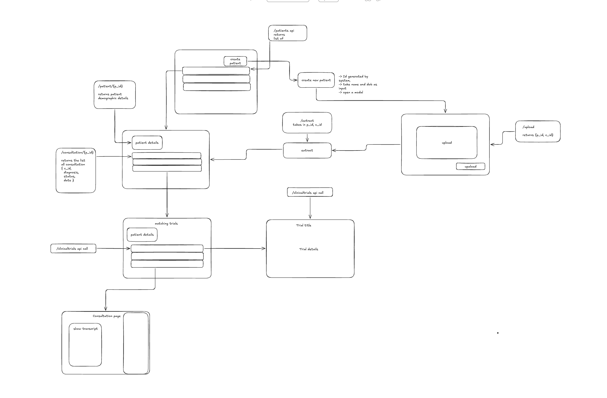
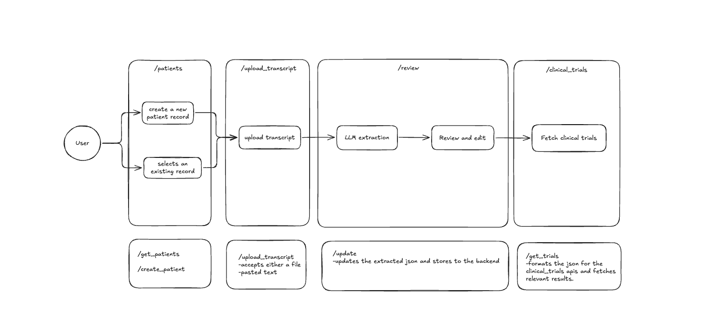

# DeepScribe Assessment

The backend is deployed in a serverless environment and may take ~2 minutes to spin up on first request.
The DB is an in-memory mock for demo purposes.
[Deployed Demo](https://deepscribe-assessment-1.onrender.com/)
***The demo is running on 0.1 CPU (free-tier) compute, so it may feel a little slow.***

## Overview

This project is a doctor-facing clinical trial matching workflow built with a clear human-in-the-loop design.

Doctors can create or select a patient, upload a consultation transcript (paste text or attach a `.txt` file), and trigger AI extraction of structured clinical data. The extracted output is presented in an editable format so clinicians can review and correct it before it's used for any downstream decisions. Once reviewed, the app fetches relevant trials from ClinicalTrials.gov and ranks them by relevance.

From an engineering perspective, the system is intentionally pragmatic: a feature-oriented React frontend, a typed FastAPI backend with focused routers, strict data models for extraction payloads, and an async extraction + polling flow that keeps the UI responsive during the 30s–1m processing window. For this assessment, persistence and job state are handled in memory to keep the architecture simple, while leaving a clean path to durable storage and queuing later.

## Assumptions

- Unauthenticated access is acceptable for the assessment (no login, role, or permission layer).
- UTF-8 plain-text transcript input is a reasonable constraint for v1 (`.txt` or pasted text only; no PDF or audio ingestion).
- The primary user is a doctor using the tool to identify relevant clinical studies and support enrollment decisions.
- In-memory storage and background jobs are acceptable for demo scope, with durability and scalability deferred.
- Consultations are assumed to be up to ~30 minutes, producing roughly ~1.5k-2.5k words of transcript text.
- A larger transcript (~4k words) is expected to process in about 1 minute.
- Async extraction with polling is preferred over a single blocking request so clinicians aren't held up during processing.
- SSE could improve live status UX, but given uncertainty around deployment/proxy timeout behaviour, polling is the safer default.
- Backend storage and job queue are intentionally in-memory for this assessment (non-persistent by design).
- Duplicate patients can currently be created — no deduplication or uniqueness guard yet.
- ClinicalTrials.gov's built-in relevance sorting (`sort=@relevance`) is sufficient for surfacing top matches (no custom ranking model).
- Only actively recruiting studies are relevant to this workflow (`filter.overallStatus=RECRUITING`).

## Contributions

- Designed the backend architecture and made the extraction-processing decision (synchronous/blocking vs async/non-blocking), ultimately implementing async + polling.
- Strict typing for llm output using pydantic and refined prompt for extraction of precise trial fields, along with other information for better decision making for clinician.
- Drove the core workflow and product decisions end to end; used AI primarily for execution support.
- Designed the UI flow and focused on a clean, intuitive clinician experience.
- Designed a human-in-the/review stage for varification of llm output.
- Freedom to change the trial criteria and test the trial output for quick feedback.

Initial planning designs:




***The designs above were created before implementation; the final implementation includes a few updates.***


## Local Setup

0. **Install prerequisites:**
   - Python `>=3.13`
   - Node.js + npm
   - `uv` (Python package manager): https://docs.astral.sh/uv/getting-started/installation/

1. **Clone the repo:**
```bash
git clone https://github.com/Cranial490/DeepScribe-assessment.git
cd DeepScribe-assessment
```

2. **Start the backend (Terminal 1):**
```bash
cd backend
```

3. **Create `backend/.env` with your OpenAI key:**
```env
OPENAI_API_KEY=your_openai_api_key_here
```

4. **Install dependencies and run FastAPI:**
```bash
uv sync
uv run uvicorn main:app --reload --host 127.0.0.1 --port 8000
```

   Backend runs at `http://127.0.0.1:8000`  
   Health check: `http://127.0.0.1:8000/health/`

5. **Start the frontend (Terminal 2):**
```bash
cd frontend
cp .env.example .env
npm install
npm run dev
```

6. **Open the app:**

   - Frontend: `http://127.0.0.1:5173`
   - Confirm `frontend/.env` contains:
```env
VITE_BACKEND_BASE_URL=http://127.0.0.1:8000
```

## Notes

- Python `>=3.13` is required (see `backend/pyproject.toml`).
- Without a valid `OPENAI_API_KEY`, transcript extraction jobs will fail — uploads will still work, but extraction won't complete.
- Data is in-memory, so restarting the backend clears all patients, consultations, and jobs.
